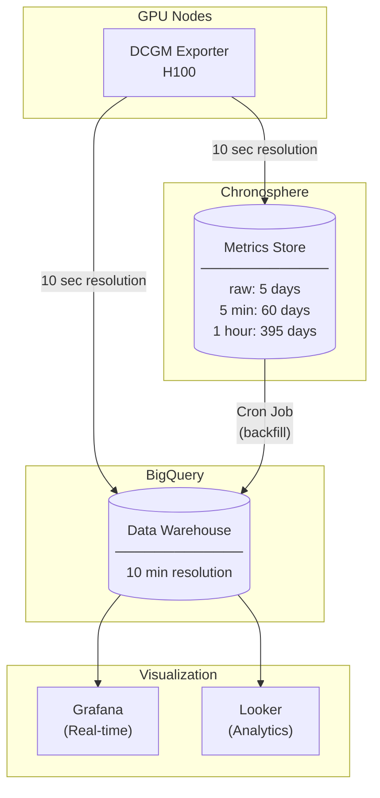

# ETL Pipeline for Multi-Cluster Compute Utilization

## Overview

This pipeline tracks and models utilization for a multi-cluster compute environment (GPU/CPU clusters). It ingests data from cluster schedulers and node monitoring agents, transforms it through staging layers, and produces analytics-ready tables for dashboards and capacity planning.

---

## Data Sources



### Data Retention Strategy

| System | Resolution | Retention | Use Case |
|--------|------------|-----------|----------|
| **Chronosphere** | Raw (10 sec) | 5 days | Real-time alerting, debugging |
| **Chronosphere** | 5 min | 60 days | Short-term trends |
| **Chronosphere** | 1 hour | 395 days | Long-term capacity planning |
| **BigQuery** | 10 min | Unlimited | Analytics, ML, dashboards |

---

## Table Schema Diagram

```
┌─────────────────────────────────────────────────────────────────────────────────────┐
│                                SOURCE LAYER (src.*)                                  │
│                                  Bronze / Raw Data                                   │
├─────────────────────────────────────────────────────────────────────────────────────┤
│                                                                                      │
│  ┌─────────────────┐   ┌─────────────────┐   ┌─────────────────┐   ┌──────────────┐ │
│  │    src.jobs     │   │ src.job_events  │   │ src.node_metrics│   │src.job_node_ │ │
│  │                 │   │                 │   │                 │   │ allocations  │ │
│  ├─────────────────┤   ├─────────────────┤   ├─────────────────┤   ├──────────────┤ │
│  │ job_id (PK)     │   │ event_id (PK)   │   │ metric_timestamp│   │allocation_id │ │
│  │ cluster_id      │   │ job_id (FK)     │   │ cluster_id      │   │ job_id (FK)  │ │
│  │ user_id         │   │ event_timestamp │   │ node_id         │   │ node_id (FK) │ │
│  │ requested_cpu   │   │ event_type      │   │ used_cpu_cores  │   │ alloc_start  │ │
│  │ requested_gpu   │   │ exit_code       │   │ used_gpu_count  │   │ alloc_end    │ │
│  │ gpu_type        │   │                 │   │ gpu_util_pct    │   │ alloc_gpus   │ │
│  │ submit_timestamp│   │                 │   │                 │   │ node_role    │ │
│  └────────┬────────┘   └────────┬────────┘   └────────┬────────┘   └──────┬───────┘ │
│           │                     │                     │                   │          │
│           │  1 job              │  N events           │  ~1440/day/node   │ N allocs │
│           │                     │  per job            │  (every minute)   │ per job  │
│                                                                                      │
│  ┌─────────────────┐                                                                 │
│  │src.cluster_config│  (daily snapshots of cluster capacity)                        │
│  └─────────────────┘                                                                 │
│                                                                                      │
└─────────────────────────────────────────────────────────────────────────────────────┘
                                         │
                                         ▼
┌─────────────────────────────────────────────────────────────────────────────────────┐
│                              STAGING LAYER (staging.*)                               │
│                                Silver / Cleaned Data                                 │
├─────────────────────────────────────────────────────────────────────────────────────┤
│                                                                                      │
│  ┌─────────────────────┐              ┌─────────────────────┐                       │
│  │ staging.jobs_cleaned│              │staging.job_events_  │                       │
│  │                     │              │       cleaned       │                       │
│  ├─────────────────────┤              ├─────────────────────┤                       │
│  │ • NULL handling     │              │ • NULL handling     │                       │
│  │ • Default values    │              │ • Validation        │                       │
│  │ • Type coercion     │              │                     │                       │
│  └──────────┬──────────┘              └──────────┬──────────┘                       │
│             │                                    │                                   │
└─────────────┼────────────────────────────────────┼───────────────────────────────────┘
              │                                    │
              │         ┌──────────────────────────┘
              │         │
              ▼         ▼
┌─────────────────────────────────────────────────────────────────────────────────────┐
│                          DIMENSION LAYER (dim.*)                                     │
├─────────────────────────────────────────────────────────────────────────────────────┤
│                                                                                      │
│  ┌─────────────┐    ┌─────────────┐    ┌─────────────┐                              │
│  │ dim.clusters│    │  dim.users  │    │  dim.time   │                              │
│  ├─────────────┤    ├─────────────┤    ├─────────────┤                              │
│  │ cluster_id  │    │ user_id     │    │ date_key    │                              │
│  │ region      │    │ team        │    │ day_of_week │                              │
│  │ cluster_type│    │ department  │    │ is_weekend  │                              │
│  └─────────────┘    └─────────────┘    └─────────────┘                              │
│                                                                                      │
└─────────────────────────────────────────────────────────────────────────────────────┘
              │
              ▼
┌─────────────────────────────────────────────────────────────────────────────────────┐
│                              FACT LAYER (fact.*)                                     │
│                                Gold / Business Events                                │
├─────────────────────────────────────────────────────────────────────────────────────┤
│                                                                                      │
│  ┌─────────────────────────────────────────────────────────────────┐                │
│  │                      fact.job_executions                         │                │
│  ├─────────────────────────────────────────────────────────────────┤                │
│  │  Built from: staging.jobs_cleaned + staging.job_events_cleaned  │                │
│  │                                                                  │                │
│  │  • One row per completed job                                     │                │
│  │  • Pivoted timestamps: submit_time, start_time, end_time        │                │
│  │  • Derived: wait_time_seconds, run_time_seconds                 │                │
│  │  • Derived: cpu_seconds, gpu_seconds (consumption)              │                │
│  └─────────────────────────────────────────────────────────────────┘                │
│                                                                                      │
└─────────────────────────────────────────────────────────────────────────────────────┘
              │
              ▼
┌─────────────────────────────────────────────────────────────────────────────────────┐
│                              MART LAYER (mart.*)                                     │
│                              Gold / Pre-Aggregated                                   │
├─────────────────────────────────────────────────────────────────────────────────────┤
│                                                                                      │
│  ┌────────────────────────┐  ┌────────────────────┐  ┌────────────────────┐        │
│  │mart.hourly_cluster_    │  │mart.daily_cluster_ │  │mart.daily_user_    │        │
│  │    utilization         │  │     summary        │  │   utilization      │        │
│  ├────────────────────────┤  ├────────────────────┤  ├────────────────────┤        │
│  │ • CPU/GPU/Memory util% │  │ • Peak utilization │  │ • Per-user GPU hrs │        │
│  │ • Jobs submitted/done  │  │ • Daily job counts │  │ • Cost allocation  │        │
│  │ • Avg/p95 wait time    │  │ • Success rate     │  │ • Efficiency       │        │
│  └────────────────────────┘  └────────────────────┘  └────────────────────┘        │
│                                                                                      │
└─────────────────────────────────────────────────────────────────────────────────────┘
              │
              ▼
┌─────────────────────────────────────────────────────────────────────────────────────┐
│                          ANALYTICS LAYER (analytics.*)                               │
│                            ML Features / Forecasting                                 │
├─────────────────────────────────────────────────────────────────────────────────────┤
│                                                                                      │
│  ┌────────────────────────────────┐    ┌────────────────────────────────┐           │
│  │analytics.utilization_forecast_ │    │   analytics.capacity_alerts    │           │
│  │          features              │    │                                │           │
│  ├────────────────────────────────┤    ├────────────────────────────────┤           │
│  │ • Lag features (1h, 24h, 1w)   │    │ • CRITICAL/WARNING/OK status   │           │
│  │ • Rolling averages             │    │ • Week-over-week growth        │           │
│  │ • Time features (hour, dow)    │    │ • Days until capacity full     │           │
│  └────────────────────────────────┘    └────────────────────────────────┘           │
│                                                                                      │
└─────────────────────────────────────────────────────────────────────────────────────┘
```

---

## ETL Process Flow

### Node Metrics Aggregation Pipeline

The critical aggregation from 10-minute samples to hourly data with percentiles:

```
┌──────────────────────────────────────────────────────────────────────────────────────┐
│                     NODE METRICS AGGREGATION PIPELINE                                 │
├──────────────────────────────────────────────────────────────────────────────────────┤
│                                                                                       │
│   src.node_metrics                                                                    │
│   (10-minute granularity, from Prometheus scrape)                                    │
│   ┌─────────────────────────────────────────────────────────────────┐                │
│   │ timestamp           │ node_id │ used_gpu │ gpu_util_pct │ ...  │                │
│   ├─────────────────────┼─────────┼──────────┼──────────────┼──────┤                │
│   │ 2026-01-15 10:00:00 │ node_a  │ 4        │ 85%          │      │                │
│   │ 2026-01-15 10:10:00 │ node_a  │ 4        │ 90%          │      │                │
│   │ 2026-01-15 10:20:00 │ node_a  │ 4        │ 88%          │      │                │
│   │ 2026-01-15 10:30:00 │ node_a  │ 4        │ 75%          │      │                │
│   │ 2026-01-15 10:40:00 │ node_a  │ 4        │ 95%          │      │                │
│   │ 2026-01-15 10:50:00 │ node_a  │ 4        │ 92%          │      │  6 rows/hr    │
│   └─────────────────────────────────────────────────────────────────┘   per node    │
│                                          │                                           │
│                                          ▼                                           │
│                     ┌─────────────────────────────────────────┐                      │
│                     │         HOURLY AGGREGATION              │                      │
│                     │         WITH PERCENTILES                │                      │
│                     ├─────────────────────────────────────────┤                      │
│                     │  GROUP BY:                              │                      │
│                     │   TIMESTAMP_TRUNC(timestamp, HOUR),     │                      │
│                     │   cluster_id                            │                      │
│                     │                                         │                      │
│                     │  AGGREGATE:                             │                      │
│                     │   AVG(gpu_util_pct)                     │                      │
│                     │   APPROX_QUANTILES(gpu_util_pct, 100):  │                      │
│                     │     [25]  → p25_gpu_util                │                      │
│                     │     [50]  → p50_gpu_util (median)       │                      │
│                     │     [75]  → p75_gpu_util                │                      │
│                     │     [95]  → p95_gpu_util                │                      │
│                     │     [99]  → p99_gpu_util                │                      │
│                     │   MAX(total_gpu)                        │                      │
│                     └───────────────────┬─────────────────────┘                      │
│                                         │                                            │
│                                         ▼                                            │
│   mart.hourly_cluster_utilization                                                    │
│   (1-hour granularity, with distribution stats)                                      │
│   ┌────────────────────────────────────────────────────────────────────────────┐     │
│   │ hour      │cluster│avg_gpu│ p25 │ p50 │ p75 │ p95 │ p99 │ cpu_util │ ... │     │
│   ├───────────┼───────┼───────┼─────┼─────┼─────┼─────┼─────┼──────────┼─────┤     │
│   │ 10:00     │ cl_01 │ 87%   │ 78% │ 88% │ 92% │ 95% │ 97% │ 65%      │     │     │
│   │ 11:00     │ cl_01 │ 92%   │ 85% │ 91% │ 95% │ 98% │ 99% │ 70%      │     │     │
│   └────────────────────────────────────────────────────────────────────────────┘     │
│                                         │                                            │
│                                         ▼                                            │
│                     ┌─────────────────────────────────────────┐                      │
│                     │         DAILY AGGREGATION               │                      │
│                     ├─────────────────────────────────────────┤                      │
│                     │  GROUP BY: DATE(hour), cluster_id       │                      │
│                     │                                         │                      │
│                     │  AGGREGATE:                             │                      │
│                     │   MAX(p99_gpu_util) → peak_util         │                      │
│                     │   AVG(avg_gpu_util) → avg_util          │                      │
│                     │   SUM(jobs_completed)                   │                      │
│                     └───────────────────┬─────────────────────┘                      │
│                                         │                                            │
│                                         ▼                                            │
│   mart.daily_cluster_summary                                                         │
│   ┌─────────────────────────────────────────────────────────────────┐                │
│   │ date       │ cluster │ peak_p99 │ avg_util │ jobs │ ...        │                │
│   ├────────────┼─────────┼──────────┼──────────┼──────┼────────────┤                │
│   │ 2026-01-15 │ cl_01   │ 99%      │ 78%      │ 1250 │            │  1 row/day    │
│   └─────────────────────────────────────────────────────────────────┘  per cluster  │
│                                                                                       │
└──────────────────────────────────────────────────────────────────────────────────────┘
```

### Why Percentiles Matter

| Metric | Use Case |
|--------|----------|
| **p50 (median)** | Typical utilization, less sensitive to outliers |
| **p75** | Upper-normal load, planning threshold |
| **p95** | Near-peak load, SLA-relevant |
| **p99** | True peak, capacity planning trigger |

Example: If `avg = 70%` but `p99 = 98%`, cluster is bursty and near capacity during peaks.

### Data Volume Reduction

| Layer | Granularity | Rows per cluster/day |
|-------|-------------|---------------------|
| `src.node_metrics` | 10 minutes | ~144 × N nodes |
| `mart.hourly_cluster_utilization` | 1 hour | 24 |
| `mart.daily_cluster_summary` | 1 day | 1 |

---

## Orchestration Schedule

```
┌──────────────────────────────────────────────────────────────────────────────────────┐
│                              AIRFLOW / dbt DAG                                        │
├──────────────────────────────────────────────────────────────────────────────────────┤
│                                                                                       │
│   ┌─────────────┐                                                                     │
│   │  STREAMING  │  Real-time / Near real-time                                        │
│   │  (Kafka →   │                                                                     │
│   │  BigQuery)  │                                                                     │
│   └──────┬──────┘                                                                     │
│          │                                                                            │
│          ▼                                                                            │
│   ┌─────────────────────────────────────────────────────────────────────────────┐    │
│   │ src.jobs, src.job_events, src.node_metrics, src.job_node_allocations        │    │
│   └─────────────────────────────────────────────────────────────────────────────┘    │
│          │                                                                            │
│          │  Every 15 minutes (or hourly)                                             │
│          ▼                                                                            │
│   ┌─────────────────────────────────────────────────────────────────────────────┐    │
│   │ staging.jobs_cleaned, staging.job_events_cleaned                             │    │
│   │ (incremental: process last 2 hours of data)                                  │    │
│   └─────────────────────────────────────────────────────────────────────────────┘    │
│          │                                                                            │
│          │  Every hour (at :05 past the hour)                                        │
│          ▼                                                                            │
│   ┌─────────────────────────────────────────────────────────────────────────────┐    │
│   │ fact.job_executions                                                          │    │
│   │ (rebuild last 2 days partition)                                              │    │
│   └─────────────────────────────────────────────────────────────────────────────┘    │
│          │                                                                            │
│          │  Every hour (at :10 past the hour)                                        │
│          ▼                                                                            │
│   ┌─────────────────────────────────────────────────────────────────────────────┐    │
│   │ mart.hourly_cluster_utilization                                              │    │
│   │ (aggregate last 2 hours from node_metrics + job data)                        │    │
│   └─────────────────────────────────────────────────────────────────────────────┘    │
│          │                                                                            │
│          │  Daily (at 01:00 UTC)                                                     │
│          ▼                                                                            │
│   ┌─────────────────────────────────────────────────────────────────────────────┐    │
│   │ mart.daily_cluster_summary, mart.daily_user_utilization                      │    │
│   │ analytics.utilization_forecast_features, analytics.capacity_alerts          │    │
│   │ dim.* tables (SCD updates)                                                   │    │
│   └─────────────────────────────────────────────────────────────────────────────┘    │
│                                                                                       │
└──────────────────────────────────────────────────────────────────────────────────────┘
```

---

## Incremental Load Patterns

Avoid expensive full-partition overwrites with these patterns:

### 1. Watermark Pattern (Incremental Append)

Track the last successfully exported timestamp, only fetch new data:

```sql
-- Watermark metadata table
CREATE TABLE meta.export_watermarks (
    table_name STRING,
    last_exported_timestamp TIMESTAMP,
    updated_at TIMESTAMP
);

-- Get watermark for incremental query
DECLARE watermark TIMESTAMP;
SET watermark = (
    SELECT last_exported_timestamp 
    FROM meta.export_watermarks 
    WHERE table_name = 'node_metrics'
);

-- Only query data AFTER the watermark
INSERT INTO src.node_metrics
SELECT * FROM external_source.node_metrics_stream
WHERE metric_timestamp > watermark
  AND metric_timestamp <= CURRENT_TIMESTAMP() - INTERVAL 5 MINUTE;  -- safety buffer

-- Update watermark after successful insert
UPDATE meta.export_watermarks
SET last_exported_timestamp = (SELECT MAX(metric_timestamp) FROM src.node_metrics),
    updated_at = CURRENT_TIMESTAMP()
WHERE table_name = 'node_metrics';
```

**Benefits:**
- Only exports new data (~30 min vs 24 hours per run)
- ~95% cost reduction
- Faster execution

**Considerations:**
- Requires watermark state management
- Need safety buffer for late-arriving data
- Recovery requires resetting watermark

### 2. MERGE Pattern (Upsert)

Insert new rows, update existing rows - no duplicates:

```sql
-- Staging table with new batch of data
CREATE TEMP TABLE staging_node_metrics AS
SELECT * FROM external_source.node_metrics_batch
WHERE metric_timestamp >= CURRENT_TIMESTAMP() - INTERVAL 2 HOUR;

-- MERGE: Insert new, update existing
MERGE INTO src.node_metrics AS target
USING staging_node_metrics AS source
ON target.metric_timestamp = source.metric_timestamp
   AND target.node_id = source.node_id
   AND target.cluster_id = source.cluster_id

WHEN MATCHED THEN UPDATE SET
    used_cpu_cores = source.used_cpu_cores,
    used_memory_gb = source.used_memory_gb,
    used_gpu_count = source.used_gpu_count,
    gpu_utilization_pct = source.gpu_utilization_pct

WHEN NOT MATCHED THEN INSERT (
    metric_timestamp, cluster_id, node_id, node_type,
    total_cpu_cores, used_cpu_cores,
    total_memory_gb, used_memory_gb,
    total_gpu_count, used_gpu_count,
    gpu_utilization_pct, ingestion_timestamp
)
VALUES (
    source.metric_timestamp, source.cluster_id, source.node_id, source.node_type,
    source.total_cpu_cores, source.used_cpu_cores,
    source.total_memory_gb, source.used_memory_gb,
    source.total_gpu_count, source.used_gpu_count,
    source.gpu_utilization_pct, CURRENT_TIMESTAMP()
);
```

**Benefits:**
- True upsert semantics
- Handles late-arriving corrections automatically
- No duplicates guaranteed
- Idempotent - safe to re-run

**Considerations:**
- Slightly more expensive than pure INSERT
- Requires defining unique key (composite key for metrics)

### Pattern Comparison

| Pattern | Write Cost | Duplicates | Late Data | Complexity |
|---------|-----------|------------|-----------|------------|
| Full overwrite | High ❌ | None | Handled | Simple |
| Watermark | Low ✓ | Possible | Need buffer | Medium |
| MERGE | Medium ✓ | None ✓ | Handled ✓ | Medium |

**Recommendation:** Use MERGE for source tables, Watermark for high-volume streaming.

---

## Key Transformations

### 1. Job Events → Job Executions (Pivot)

```sql
-- Multiple event rows per job → One summary row
SELECT
    job_id,
    MAX(CASE WHEN event_type = 'SUBMITTED' THEN timestamp END) AS submit_time,
    MAX(CASE WHEN event_type = 'RUNNING' THEN timestamp END) AS start_time,
    MAX(CASE WHEN event_type = 'COMPLETED' THEN timestamp END) AS end_time
FROM job_events
GROUP BY job_id
```

### 2. Node Metrics → Hourly Utilization (Aggregate)

```sql
-- 60 minute-level rows → 1 hourly row per cluster
SELECT
    TIMESTAMP_TRUNC(metric_timestamp, HOUR) AS hour_timestamp,
    cluster_id,
    AVG(used_gpu_count) AS avg_used_gpus,
    AVG(gpu_utilization_pct) AS avg_gpu_util,
    SAFE_DIVIDE(AVG(used_gpu_count), MAX(total_gpu_count)) * 100 AS gpu_allocation_pct
FROM node_metrics
GROUP BY 1, 2
```

### 3. Hourly → Daily (Roll-up)

```sql
-- 24 hourly rows → 1 daily row per cluster  
SELECT
    DATE(hour_timestamp) AS summary_date,
    cluster_id,
    MAX(gpu_allocation_pct) AS peak_gpu_allocation,
    AVG(gpu_allocation_pct) AS avg_gpu_allocation
FROM hourly_cluster_utilization
GROUP BY 1, 2
```

---

## Relationships

```
                    ┌─────────────┐
                    │  src.jobs   │
                    │  (job_id)   │
                    └──────┬──────┘
                           │
           ┌───────────────┼───────────────┐
           │               │               │
           ▼               ▼               ▼
    ┌─────────────┐ ┌─────────────┐ ┌─────────────────┐
    │job_events   │ │job_node_    │ │fact.job_        │
    │(job_id FK)  │ │allocations  │ │executions       │
    │             │ │(job_id FK)  │ │(derived)        │
    └─────────────┘ └──────┬──────┘ └─────────────────┘
                           │
                           ▼
                    ┌─────────────┐
                    │node_metrics │
                    │(node_id)    │
                    └─────────────┘
```

**Key relationships:**
- `job_id` connects jobs → events → allocations → fact table
- `node_id` connects allocations → node_metrics
- `cluster_id` is the common grain for utilization aggregations
